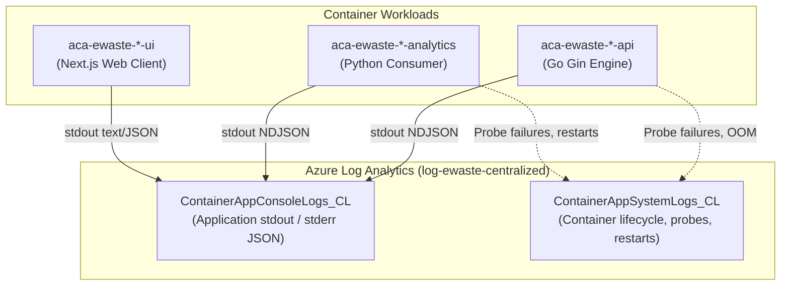

# Azure Monitor & Processing Telemetry Reference Guide

## Platform Logging, Log Analytics Workbooks & Operational Troubleshooting Runbook

This document is the **authoritative operational reference guide** for querying, analyzing, and troubleshooting telemetry across all services of the Responsible E-Waste Platform. It provides exact log schemas, copy-paste Azure Monitor (KQL) queries, and step-by-step diagnostic workflows for investigating live system behavior.

---

## 1. Quick Start: Accessing Logs

All Container Apps write JSON logs to `stdout`/`stderr`, which are ingested into the shared **Azure Log Analytics Workspace**:

| Resource                    | Value in Dev (`dev`)       | Value in Staging (`stg`)   | Value in Production (`prod`) |
| :-------------------------- | :------------------------- | :------------------------- | :--------------------------- |
| **Resource Group**          | `rg-ewaste-dev`            | `rg-ewaste-stg`            | `rg-ewaste-prod`             |
| **Log Analytics Workspace** | `log-ewaste-centralized`   | `log-ewaste-centralized`   | `log-ewaste-centralized`     |
| **API Container App**       | `aca-ewaste-dev-api`       | `aca-ewaste-stg-api`       | `aca-ewaste-prod-api`        |
| **Analytics Worker App**    | `aca-ewaste-dev-analytics` | `aca-ewaste-stg-analytics` | `aca-ewaste-prod-analytics`  |
| **Frontend UI App**         | `aca-ewaste-dev-ui`        | `aca-ewaste-stg-ui`        | `aca-ewaste-prod-ui`         |

### 1.1 Access via Azure Portal

1. Open the [Azure Portal](https://portal.azure.com).
2. Navigate to **Log Analytics Workspaces** $\rightarrow$ select **`log-ewaste-centralized`**.
3. Click **Logs** in the left navigation sidebar.
4. Copy and paste any of the KQL queries from [Section 4](#4-reusable-kql-query-library).

### 1.2 Access via Azure CLI (Live Streaming / Tail)

To stream console logs in real time from your terminal:

```bash
# Stream Go API logs
az containerapp logs show \
  --name aca-ewaste-dev-api \
  --resource-group rg-ewaste-dev \
  --follow \
  --format text

# Stream Python Analytics Worker logs
az containerapp logs show \
  --name aca-ewaste-dev-analytics \
  --resource-group rg-ewaste-dev \
  --follow \
  --format text
```

---

## 2. Telemetry Architecture & Log Tables

Container Apps logs are segregated into two primary Log Analytics tables:



### Table Reference:

- **`ContainerAppConsoleLogs_CL`**: Contains all structured application events emitted by the Go API and Python Worker. Key raw column: `Log_s` (JSON string).
- **`ContainerAppSystemLogs_CL`**: Contains platform lifecycle events generated by Azure Container Apps (restarts, health probe failures, image pulls, scaling decisions).

---

## 3. Structured Telemetry Data Dictionary

All components format standard stdout logs as single-line NDJSON.

### 3.1 Field Catalog

| Field Name                 |        Type        | Emitted By  | Description / Example Values                                                                                                       |
| :------------------------- | :----------------: | :---------: | :--------------------------------------------------------------------------------------------------------------------------------- |
| `timestamp`                | `string` (ISO8601) |     All     | Microsecond UTC timestamp (`2026-10-05T09:15:30.123456Z`).                                                                         |
| `component`                |      `string`      |     All     | Source workload: `"workflow-api"`, `"matcher-worker"`, or `"workflow-ui"`.                                                         |
| `level`                    |      `string`      |     All     | Severity level: `DEBUG`, `INFO`, `WARN`, `ERROR`.                                                                                  |
| `correlation_id`           |  `string` (1–128)  |     All     | Durable business trace ID. Preserved across HTTP body, database outbox, Kafka headers, and matcher decisions.                      |
| `transport_correlation_id` |  `string` (UUID)   |     API     | Per-attempt HTTP trace ID from `X-Correlation-ID` header. Used for transport diagnostics; never saved in durable business hashes.  |
| `batch_id`                 |  `string` (UUID)   | API, Worker | E-waste batch identifier (`b0000000-0000-4000-8000-000000000001`).                                                                 |
| `event_id`                 |  `string` (UUID)   | API, Worker | Unique immutable outbox event ID (`e0000000-0000-4000-8000-000000000001`).                                                         |
| `event_type`               |      `string`      | API, Worker | Domain event name: `RequestSubmitted`, `ReceiptVerified`, `RecyclingCompleted`, `ClaimConfirmed`.                                  |
| `run_id`                   |  `string` (UUID)   | API, Worker | Unique matching run execution ID (`r0000000-0000-4000-8000-000000000001`).                                                         |
| `observation`              |      `string`      |   Worker    | Worker event name: `partitions_assigned`, `delivery_paused`, `offset_committed`, `offset_commit_failed`, `consumer_error`.         |
| `stage`                    |      `string`      |   Worker    | State machine phase: `VALIDATE_EVENT`, `PREPARE`, `EVALUATE`, `COMMIT`, `REFRESH`, `QUARANTINE`, `DONE`.                           |
| `latency_ms`               |     `integer`      |     All     | Elapsed duration in milliseconds. Numeric integer for direct percentile aggregation.                                               |
| `retry_count`              |     `integer`      |   Worker    | Total retry attempts across the lifecycle of this delivery.                                                                        |
| `failure_streak`           |     `integer`      |   Worker    | Consecutive failures driving exponential backoff delay.                                                                            |
| `error_code`               |      `string`      |     All     | Machine-readable error: `STATE_CONFLICT`, `VALIDATION_FAILED`, `TRANSIENT_TIMEOUT`, `FACADE_UNAVAILABLE`, `WORKER_INTERNAL_ERROR`. |
| `disposition`              |      `string`      |   Worker    | Terminal outcome: `COMMITTED`, `SKIPPED`, `QUARANTINED`.                                                                           |
| `topic`                    |      `string`      |   Worker    | Kafka topic name: `matching.requests`, `matching.quarantine`.                                                                      |
| `partition`                |     `integer`      |   Worker    | Kafka partition number (0-indexed).                                                                                                |
| `offset`                   |      `string`      |   Worker    | High-watermark Kafka message offset (`"104"`).                                                                                     |

### 3.2 Canonical JSON Log Samples

#### Go API Output (`workflow-api`):

```json
{
  "timestamp": "2026-10-05T09:15:30.123Z",
  "level": "info",
  "component": "workflow-api",
  "msg": "http request",
  "method": "POST",
  "path": "/api/v1/batches/b0000000-0000-4000-8000-000000000001/submit",
  "status": 200,
  "duration": "14.215ms",
  "latency_ms": 14,
  "correlation_id": "c1-fixture-submit-001"
}
```

#### Python Analytics Worker Output (`matcher-worker`):

```json
{
  "timestamp": "2026-10-05T09:15:31.450Z",
  "component": "matcher-worker",
  "observation": "offset_committed",
  "topic": "matching.requests",
  "partition": 0,
  "offset": "104",
  "stage": "DONE",
  "retry_count": 0,
  "failure_streak": 0,
  "disposition": "COMMITTED",
  "latency_ms": 1320,
  "event_id": "e0000000-0000-4000-8000-000000000001",
  "batch_id": "b0000000-0000-4000-8000-000000000001",
  "correlation_id": "c1-fixture-submit-001",
  "run_id": "r0000000-0000-4000-8000-000000000001"
}
```

---

## 4. Reusable KQL Query Library

Copy and paste these queries directly into the Azure Log Analytics query editor.

### 4.1 End-to-End Request Tracing (Trace by ID)

Use this query to trace every step of a batch from initial user submission through to database commit.

```kql
// Trace a specific batch or correlation trace across all components
let search_id = "c1-fixture-submit-001"; // Replace with batch_id or correlation_id
ContainerAppConsoleLogs_CL
| where TimeGenerated >= ago(24h)
| extend log = parse_json(Log_s)
| extend
    CorrelationId = tostring(coalesce(log.correlation_id, log.transport_correlation_id)),
    BatchId = tostring(log.batch_id),
    Component = tostring(log.component),
    Event = tostring(coalesce(log.observation, log.msg, log.message)),
    Stage = tostring(log.stage),
    Status = tostring(coalesce(log.status, log.disposition)),
    LatencyMs = toint(log.latency_ms),
    ErrorCode = tostring(log.error_code)
| where CorrelationId == search_id or BatchId == search_id or Log_s has search_id
| project
    TimeGenerated,
    Component,
    ContainerAppName_s,
    Event,
    Stage,
    Status,
    LatencyMs,
    CorrelationId,
    BatchId,
    ErrorCode,
    RawLog = Log_s
| order by TimeGenerated asc
```

---

### 4.2 Latency Percentiles & SLO Compliance (P50, P90, P95, P99)

Monitors platform response times against Sprint 3 SLO targets:

- **API Command Latency:** P95 < 3,000 ms (3 seconds).
- **Worker Async Processing Latency:** P95 < 10,000 ms (10 seconds).

```kql
// Compute response latency distribution and flag SLO breaches
ContainerAppConsoleLogs_CL
| where TimeGenerated >= ago(6h)
| extend log = parse_json(Log_s)
| extend
    Component = tostring(log.component),
    LatencyMs = toreal(log.latency_ms)
| where isnotnull(LatencyMs) and LatencyMs > 0
| summarize
    TotalRequests = count(),
    AvgLatencyMs = round(avg(LatencyMs), 2),
    P50_Ms = round(percentile(LatencyMs, 50), 2),
    P90_Ms = round(percentile(LatencyMs, 90), 2),
    P95_Ms = round(percentile(LatencyMs, 95), 2),
    P99_Ms = round(percentile(LatencyMs, 99), 2),
    MaxLatencyMs = max(LatencyMs)
    by Component, bin(TimeGenerated, 15m)
| extend SLO_Threshold_Ms = iff(Component == "workflow-api", 3000, 10000)
| extend SLO_Breached = P95_Ms > SLO_Threshold_Ms
| order by TimeGenerated desc, Component asc
```

---

### 4.3 Error Diagnosis: HTTP Failures & Worker Rejections

Identifies all failed operations, error codes, and the specific batches affected.

```kql
// Summarize errors, paused deliveries, and HTTP 4xx/5xx responses
ContainerAppConsoleLogs_CL
| where TimeGenerated >= ago(12h)
| extend log = parse_json(Log_s)
| extend
    Component = tostring(log.component),
    HttpStatus = toint(log.status),
    Observation = tostring(log.observation),
    Stage = tostring(log.stage),
    ErrorCode = tostring(coalesce(log.error_code, log.code)),
    BatchId = tostring(log.batch_id),
    CorrelationId = tostring(log.correlation_id),
    Path = tostring(log.path)
| where HttpStatus >= 400
     or Observation in ("delivery_paused", "matching_request_failed", "offset_commit_failed", "consumer_error")
     or Stage == "QUARANTINE"
     or isnotempty(ErrorCode)
| summarize
    ErrorCount = count(),
    AffectedBatches = dcount(BatchId),
    SampleTrace = take_any(CorrelationId)
    by Component, HttpStatus, ErrorCode, Stage, Path, bin(TimeGenerated, 1h)
| order by TimeGenerated desc, ErrorCount desc
```

---

### 4.4 Worker Retries, Backoff Streaks & Partition Pauses

Detects repeated worker retries before an event drops into quarantine or stalls a partition.

```kql
// Track retry streaks and delivery pauses in the Python Worker
ContainerAppConsoleLogs_CL
| where TimeGenerated >= ago(4h)
| extend log = parse_json(Log_s)
| where tostring(log.component) == "matcher-worker"
| extend
    Observation = tostring(log.observation),
    RetryCount = toint(log.retry_count),
    FailureStreak = toint(log.failure_streak),
    Partition = toint(log.partition),
    Offset = tostring(log.offset),
    ErrorCode = tostring(log.error_code),
    CorrelationId = tostring(log.correlation_id),
    BatchId = tostring(log.batch_id)
| where RetryCount > 0 or FailureStreak > 0 or Observation == "delivery_paused"
| project
    TimeGenerated,
    Observation,
    Partition,
    Offset,
    RetryCount,
    FailureStreak,
    ErrorCode,
    CorrelationId,
    BatchId
| order by TimeGenerated desc
```

---

### 4.5 Kafka Consumer Group Activity & Commit Throughput

Measures consumption velocity and ensures offsets are committing without error.

```kql
// Measure Kafka offset commits and commit failure rates
ContainerAppConsoleLogs_CL
| where TimeGenerated >= ago(2h)
| extend log = parse_json(Log_s)
| where tostring(log.component) == "matcher-worker"
| extend
    Observation = tostring(log.observation),
    Topic = tostring(log.topic),
    Partition = toint(log.partition),
    Offset = tolong(log.offset)
| where Observation in ("offset_committed", "offset_commit_failed")
| summarize
    CommittedCount = countif(Observation == "offset_committed"),
    FailedCommitCount = countif(Observation == "offset_commit_failed"),
    HighestOffset = max(Offset)
    by Topic, Partition, bin(TimeGenerated, 5m)
| order by TimeGenerated desc, Partition asc
```

---

### 4.6 Container App Health, Liveness/Readiness Probes & Restarts

Uses `column_ifexists()` to safely query container restart signals, crash loops, and probe failures without breaking on dynamic schemas.

```kql
// Monitor container crashes, terminations, and probe failures
ContainerAppSystemLogs_CL
| where TimeGenerated >= ago(24h)
| extend
    Reason = tostring(column_ifexists("Reason_s", "")),
    SubReason = tostring(column_ifexists("SubReason_s", ""))
| where Reason in ("ContainerTerminated", "ContainerCrashing", "Unhealthy", "ProbeFailed")
     or Log_s has_any ("unhealthy", "probe failed", "terminated", "restarting")
| project
    TimeGenerated,
    ContainerAppName_s,
    RevisionName_s,
    Reason,
    SubReason,
    Log_s
| order by TimeGenerated desc
```

---

## 5. Operational Troubleshooting Runbook

Follow these workflows when investigating common platform incidents.

### 5.1 Scenario A: Investigating a Stuck or Missing Batch

1. **Locate the Submission:** Run [Query 4.1](#41-end-to-end-request-tracing-trace-by-id) using the `batch_id` or `correlation_id`.
2. **Determine the Drop Point:**
   - If **no rows appear:** The request did not reach the Go API (check ingress firewall or client connection).
   - If only `workflow-api` appears: The API accepted the batch, but the event was not picked up. Check if the MySQL transaction committed and verify the outbox relay process.
   - If `matcher-worker` appears with `delivery_paused`: The worker encountered a transient error (e.g., facade unavailable) and entered backoff. Check `error_code`.
   - If `matcher-worker` appears with `stage: "QUARANTINE"`: The payload failed schema validation or had mismatched hashes. Inspect `error_code` (`VALIDATION_FAILED`, `CONTRACT_VIOLATION`).

---

### 5.2 Scenario B: Investigating High Latency or Timeout Alerts

1. Run [Query 4.2](#42-latency-percentiles--slo-compliance-p50-p90-p95-p99) to identify whether latency is concentrated in `workflow-api` or `matcher-worker`.
2. If `workflow-api` is high:
   - Check if database queries are locking tables. Verify Flexible Server CPU/Memory metrics in Azure Portal.
3. If `matcher-worker` is high:
   - Check [Query 4.4](#44-worker-retries-backoff-streaks--partition-pauses). If `failure_streak` is high, delays are caused by exponential backoff rather than slow compute.

---

### 5.3 Scenario C: Diagnosing a Failing Readiness Probe (`/readyz`)

If Azure Container Apps is not routing traffic to a container:

| Symptom                                               | Cause                                                                                                 | Resolution                                                                                                                                                         |
| :---------------------------------------------------- | :---------------------------------------------------------------------------------------------------- | :----------------------------------------------------------------------------------------------------------------------------------------------------------------- |
| **API `/readyz` returns 503**                         | Database ping failed or MySQL pool exhausted.                                                         | Check Azure MySQL Flexible Server connectivity and max connection settings in Key Vault.                                                                           |
| **Worker `/readyz` returns 503**                      | Kafka broker is disconnected (`UP=false`), stats are stale (>15s), or a partition is paused on error. | Check Event Hubs connection strings. Run [Query 4.4](#44-worker-retries-backoff-streaks--partition-pauses) to see if a poison-pill message has paused a partition. |
| **Worker `/readyz` returns 200 but `/healthz` fails** | Main polling thread deadlocked (>120s since last poll).                                               | Container Apps will automatically restart the unhealthy replica. Check [Query 4.6](#46-container-app-health-livenessreadiness-probes--restarts).                   |

---

## 6. Audit & Traceability Appendix

| Component                    | Telemetry Standard                                                 | Redaction Guarantee                                    |   Status   |
| :--------------------------- | :----------------------------------------------------------------- | :----------------------------------------------------- | :--------: |
| **`workflow-api`**           | Standardized JSON with `component`, `correlation_id`, `latency_ms` | Passwords, bearer tokens, and binary files excluded    | **ACTIVE** |
| **`matcher-worker`**         | Structured `observe()` emission with latency and failure streaks   | Unparsed bodies, tokens, snapshots excluded            | **ACTIVE** |
| **`log-ewaste-centralized`** | Reusable KQL suite across 6 operational categories                 | 30-day retention; accessible via Portal and Azure CLI  | **ACTIVE** |
| **Probe Signals**            | Sub-second `/healthz` and `/readyz` endpoints wired to ACA         | Prevents traffic routing to paused/unhealthy instances | **ACTIVE** |
